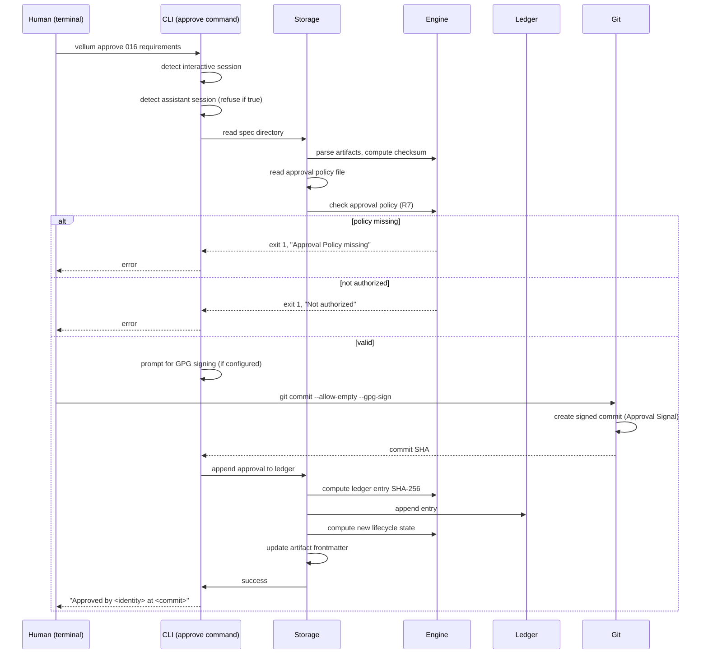
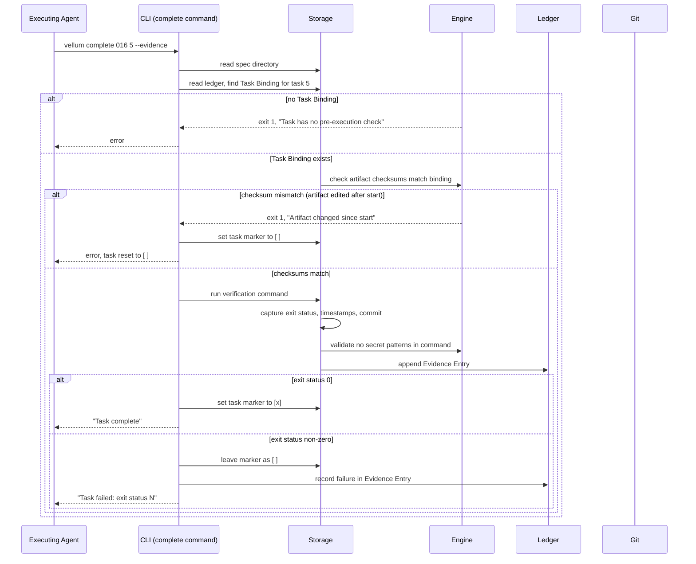
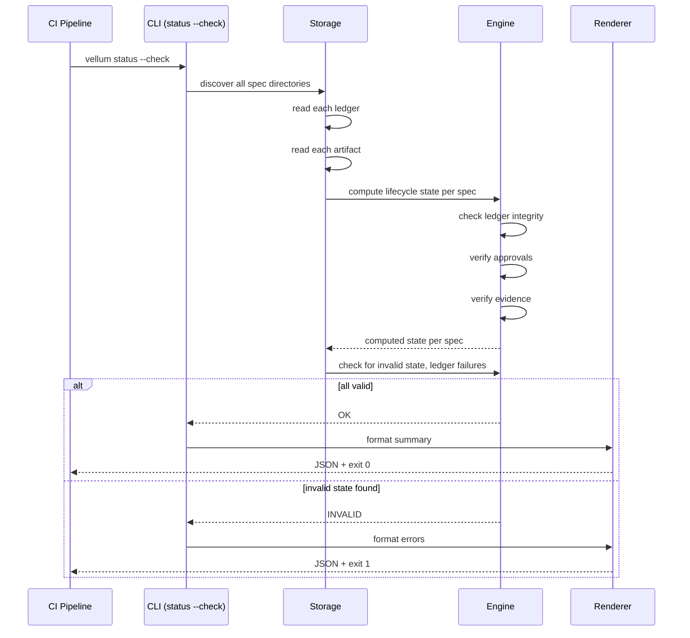
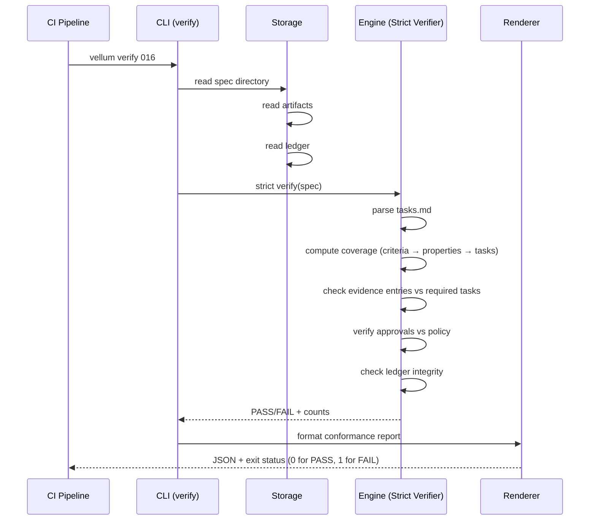
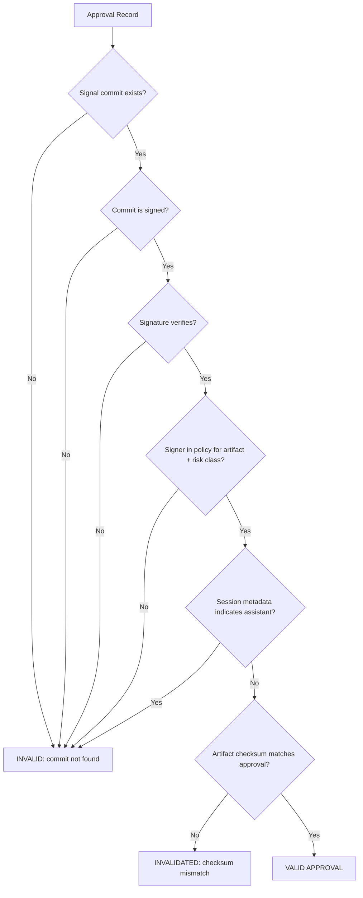
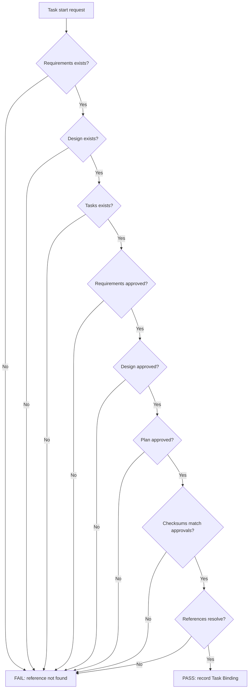
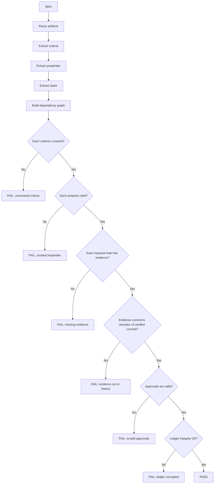

# Design Document

## Overview

Slice 1 is the enforceable core of the Vellum SDLC Platform. It holds the part everything else rests on: one pinned installation and one canonical implementation; the hash-chained Ledger and the lifecycle state machine; human-only approvals verifiable in CI; evidence the engine writes; protocol validation; strict verification; projection; and the spec folder contract. Every later slice builds on these foundations.

The design follows one inviolable principle: **Git is the database**. No SQLite, no vector stores, no persistent caches outside the repository. Every decision the engine can compute is computed from repository content and the pinned version alone. This makes the engine deterministic, reproducible on any clone, and verifiable in CI without secrets or network.

The design has six packages, organized by responsibility:

1. **`@vellum/protocol`** — types, schemas, frontmatter definitions, and the Markdown Protocol. Zero dependencies. The contract.
2. **`@vellum/engine`** — pure functions that compute lifecycle state, approvals, evidence, and verification. No filesystem, no git, no network, no clock. Stateless. The logic.
3. **`@vellum/storage`** — the ONLY package with I/O. Reads and writes files, git repository state, and the Ledger. Wraps the engine with side effects.
4. **`@vellum/renderers`** — output projections: status JSON, conformance reports, CI adapters, and diagnostics. Pure functions that consume engine output.
5. **`@vellum/cli`** — the command surface. Thin entry points that parse arguments, invoke storage, and call renderers.
6. **`@vellum/mcp`** — read-only MCP server for assistants. Exposes engine queries without mutation.

**Approach:** a pure engine that decides from repository content, wrapped by a storage layer that reads and writes, surfaced through a thin CLI and MCP interface, with zero runtime dependencies in the published package.

**Key trade-off:** the engine is pure but the storage layer must read files and git history. CI verification therefore requires a checkout, not just a diff. The alternative—storing decisions in a separate database—would break traceability and the guarantee that any clone can recompute every decision from the commit alone.

### Research summary

`requirements.md` established 23 requirements across six slices. This design addresses Requirements 1–23, all marked **Delivery slice: 1**. Discovery in the programme spec (001) established:

- **Stage is inferred from file existence.** `tools/spec/spec-status.mjs` defines five stages (`empty`, `requirements`, `design`, `tasks`, `invalid`). No approval is recorded anywhere.
- **Task markers are the only record of execution.** Four markers: `[ ]`, `[~]`, `[-]`, `[x]`. No evidence links a tick to a command.
- **Three copies of the spec tools disagree.** `tools/spec/` in basalt, `scripts/` and `lib/` in the plugin. Line counts differ. `lib/` is untracked.
- **The plugin cannot find its own files.** 22 references to `${CLAUDE_PLUGIN_ROOT}`. The validator resolves instead of rejecting.
- **CI runs the basalt copies.** GitLab `structure` job runs `pnpm run spec:lint`, `spec:status --check`, and `agents:check`.
- **No approver list exists.** `CODEOWNERS` was deleted in commit `4b596e2`.
- **The secret scan covers the spec tree.** gitleaks runs, `.agents/specs/` is not exempted.
- **The Ledger would be a fourth file.** ADR-0040 allows exactly three files. Requirement 23 resolves with one hidden `.sdlc/` Machine Folder.

**What this design introduces:**

- A hash-chained Ledger inside `.sdlc/ledger.jsonl` per spec.
- Lifecycle frontmatter in each artifact with version, checksum, and state.
- Approval records bound to exact artifact checksums, backed by signed commits.
- Evidence entries without command output, recording only exit status, timestamps, and commit.
- A state machine with recorded state, not inferred state.
- Pure engine functions that decide state from content and the pinned version.
- Deterministic, property-testable invariants.

**What design stops short of:**

- Policy and execution control (Slice 2).
- Quality checks and gates (Slice 3).
- Metrics (Slice 4).
- Writing ADR-0040 amendment (ownership: `architecture-guardian`, `docs-governance`).

### Applicable standards

| Standard                                                                                                  | What it governs here                                                                                                | Check                                                                                  |
| --------------------------------------------------------------------------------------------------------- | ------------------------------------------------------------------------------------------------------------------- | -------------------------------------------------------------------------------------- |
| `apps/docs/src/adr/0054-spec-engine-ships-as-a-package-and-cli.md`                                        | One versioned package and CLI; CI fetches without a GitLab variable; skills never depend on `${PLUGIN_ROOT}`        | Release pipeline                                                                       |
| `apps/docs/src/adr/0040-spec-folder-structure.md`                                                         | The spec folder contract — must be amended for `.sdlc/` (Requirement 23)                                           | Protocol Validator finding `SPEC_EXTRA_FILE` → `SPEC_INVALID_ENTRY`                    |
| `.agents/rules/workspace-layout.md`                                                                       | `.agents/specs/` is the one specs tree                                                                              | `validate-repository.mjs`                                                              |
| `.agents/rules/secrets.md`                                                                                | No secret value in evidence, ledger, or any file                                                                    | gitleaks; Evidence Recorder refuses secret patterns                                   |
| `.agents/rules/versions.md`                                                                                | Catalog references, never literals                                                                                  | `validate-repository.mjs`                                                              |
| `.agents/rules/task-vocabulary.md`                                                                        | The seven task names                                                                                                | Turborepo scheduling                                                                   |
| `.agents/rules/concurrent-sessions.md`                                                                    | Index-level check for concurrent writes                                                                             | Pre-commit hook (Requirement 003:4)                                                   |
| `apps/docs/src/adr/0036-package-shape-follows-archetype.md`                                               | Package archetypes: `platform`, `domain`, `tooling`                                                                | `pnpm scaffold`                                                                        |
| `apps/docs/src/adr/0022-package-public-exports.md`                                                        | `exports` map and subpaths                                                                                          | `package-steward` review                                                              |

Three rows require actions outside this spec: ADR-0040 amendment (ownership: `architecture-guardian`), and the concurrent-sessions check (Requirement 003:4, Slice 2).

## Glossary

Every term in `requirements.md` is inherited. This table adds only what this document introduces.

| Term                       | Definition                                                                                                                                                                                                  |
| -------------------------- | ----------------------------------------------------------------------------------------------------------------------------------------------------------------------------------------------------------- |
| Machine Folder             | The one hidden folder, `.sdlc/`, inside a Spec Directory. Only the Platform writes it. Holds the Ledger and Platform State files. Kiro does not render it.                                                 |
| Ledger                     | An append-only, hash-chained file `ledger.jsonl` inside `.sdlc/`. Records approvals, decisions, evidence, claims, failures, amendments, gate results, merges, and releases.                                 |
| Ledger Entry               | One JSON line in the Ledger. Carries: sequence number, kind, timestamp, predecessor hash, and payload. Immutable once written.                                                                             |
| Lifecycle Frontmatter      | YAML block at the top of each artifact (`requirements.md`, `design.md`, `tasks.md`). Carries: version, checksum, state, timestamps.                                                                        |
| Artifact Version           | Integer incremented monotonically when the artifact body changes. Starts at 1. Reset only on adoption.                                                                                                     |
| Artifact Checksum          | SHA-256 hash of the artifact body, excluding frontmatter. Used to bind approvals and evidence to exact content.                                                                                            |
| Valid Approval             | An approval backed by a signed commit or verified identity signal, from an authorized approver, at the required risk class, bound to the current artifact checksum.                                          |
| Invalidated Approval       | An approval whose artifact checksum differs from the current artifact checksum. Not counted toward approval requirements.                                                                                   |
| Unverified Completion      | A task marked `[x]` without a corresponding Evidence Entry with exit status 0.                                                                                                                             |
| Evidence Entry             | Ledger entry recording: task identifier, command text, exit status, timestamps, HEAD commit, affected paths, environment versions. Excludes stdout and stderr.                                             |
| Task Binding               | Ledger entry recording: task identifier, artifact versions and checksums resolved at pre-execution check time. Binds evidence to specific versions.                                                         |
| Check Result               | One of: `PASS`, `FAIL`, `INCONCLUSIVE`. Every check reports one.                                                                                                                                           |
| Not-Applicable Report      | Report issued when a check's input is absent and that absence is permitted. Distinct from `PASS` in both human-readable and machine-readable output.                                                      |
| Examination Summary        | Summary naming each kind of item examined and the count. Required for every `PASS` result.                                                                                                                 |
| Rule Identifier            | Unique string for each diagnostic rule: `<package>/<category>/<snake_case>`. Example: `vellum/protocol/CRITERIA_NOT_COVERED`.                                                                              |
| Finding                    | Diagnostic emitted by a validator: file path, line number, Rule Identifier, message.                                                                                                                      |
| Diagnostic Code            | Error or warning code emitted by the engine or CLI. Format: `E<NNNN>` for errors, `W<NNNN>` for warnings.                                                                                                  |
| Disposed Cache             | Optional cache location outside version control. Used for computed results. Discarded on version mismatch or read error. Never affects output.                                                              |
| Parity Commit              | Pinned commit of the Consumer Repository against which parity with the Legacy Tooling is measured.                                                                                                         |
| Parity Fixture             | Fixture recording expected output of the Legacy Tooling at the Parity Commit.                                                                                                                              |
| Pre-Execution Check        | Check run before a task is dispatched. Confirms presence, approval, and checksum match of requirements, design, and plan. Records Task Binding.                                                            |
| Strict Verifier            | Verification that checks the complete chain from criteria → properties → tasks → evidence → approvals. Reports satisfied/total counts and PASS/FAIL.                                                       |
| Effective Lifecycle State  | The state computed from repository content, considering preconditions. May differ from Recorded Lifecycle State when preconditions fail.                                                                   |
| Recorded Lifecycle State   | The state stored in lifecycle frontmatter. Updated only on valid transitions.                                                                                                                              |
| Legacy Stage               | Stage derived from artifact presence for a Legacy Spec: `empty`, `requirements`, `design`, `tasks`, `invalid`.                                                                                             |

## Architecture

Slice 1 is six packages, deployed as one npm package named `@figentra/vellum` (ADR-0054 naming decision pending Assumption 3). The package publishes the CLI binary `vellum` and exports the programmatic API for MCP and future integrations.

```
@figentra/vellum
├── protocol/      # Types, schemas, frontmatter — zero deps
├── engine/        # Pure logic — no fs, git, network, clock
├── storage/       # I/O — fs, git, ledger
├── renderers/     # Output formatters — pure functions
├── cli/           # Command surface — thin entry points
└── mcp/           # MCP server — read-only queries
```

**Dependency flow:**

```
cli ──────> storage ──────> engine ──────> protocol
mcp ───────┘               │                ▲
renderers ─┘               └────────────────┘
```

- `protocol/` imports nothing. It is types and schemas only.
- `engine/` imports `protocol/`. Pure functions, no side effects.
- `storage/` imports `engine/` and `protocol/`. Wraps engine with I/O.
- `renderers/` imports `engine/` and `protocol/`. Formats output.
- `cli/` imports `storage/`, `engine/`, `renderers/`, and `protocol/`. Entry points.
- `mcp/` imports `storage/` and `renderers/`. Read-only queries.

**Zero runtime dependencies in the published package.** The package may use dev dependencies for testing (vitest, fast-check, etc.) but publishes with no `dependencies` in `package.json`. All engine and protocol code uses only Node.js builtins and type annotations.

### Package layout

```
packages/vellum/
├── package.json              # name: @figentra/vellum, bin: vellum, exports: ., ./engine, ./protocol, ./storage, ./renderers
├── src/
│   ├── protocol/
│   │   ├── types.ts          # Artifact, Ledger, Evidence, Approval, Diagnostic types
│   │   ├── schemas.ts        # Zod schemas for JSON/YAML validation
│   │   ├── frontmatter.ts    # YAML parsing/serialization, checksum computation
│   │   ├── markers.ts        # Task marker grammar and parsing
│   │   ├── grammar.ts        # Kiro Task Line Grammar, requirements trailer syntax
│   │   └── index.ts          # Public exports
│   ├── engine/
│   │   ├── lifecycle.ts      # State machine transitions, precondition checks
│   │   ├── approval.ts       # Approval verification, identity binding
│   │   ├── evidence.ts       # Evidence validation, task binding
│   │   ├── verification.ts   # Strict verification chain
│   │   ├── coverage.ts       # Criteria/properties coverage computation
│   │   ├── legacy.ts         # Legacy stage derivation
│   │   ├── ledger.ts         # Ledger integrity checks (pure, over entries)
│   │   ├── parse.ts          # Artifact parsing, task graph construction
│   │   └── index.ts          # Public exports
│   ├── storage/
│   │   ├── repository.ts     # Git operations: HEAD, commit lookup, diff, checkout
│   │   ├── filesystem.ts     # File read/write, spec directory discovery
│   │   ├── ledger.ts         # Ledger append, read, validate (storage + engine calls)
│   │   ├── artifacts.ts      # Artifact read/write with frontmatter
│   │   ├── cache.ts          # Disposed cache management
│   │   └── index.ts          # Public exports
│   ├── renderers/
│   │   ├── status.ts         # Status JSON schema and formatter
│   │   ├── diagnostics.ts    # Human-readable diagnostic output
│   │   ├── conformance.ts    # Conformance report for CI
│   │   ├── check-result.ts   # PASS/FAIL/INCONCLUSIVE/Not-Applicable output
│   │   └── index.ts          # Public exits
│   ├── cli/
│   │   ├── commands/
│   │   │   ├── lint.ts       # vellum lint [artifact-type]
│   │   │   ├── status.ts     # vellum status [spec] --check --json
│   │   │   ├── approve.ts    # vellum approve <spec> <artifact>
│   │   │   ├── reject.ts     # vellum reject <spec> <artifact> --rationale <text>
│   │   │   ├── start.ts      # vellum start <spec> <task>
│   │   │   ├── complete.ts   # vellum complete <spec> <task> --evidence
│   │   │   ├── verify.ts     # vellum verify [spec]
│   │   │   ├── sync.ts       # vellum sync [--check] [--target <assistant>]
│   │   │   ├── adopt.ts      # vellum adopt <spec>
│   │   │   ├── doctor.ts     # vellum doctor [category]
│   │   │   ├── version.ts    # vellum version
│   │   │   └── help.ts       # vellum help [command]
│   │   ├── args.ts           # Argument parsing, validation
│   │   ├── output.ts         # stdout/stderr formatting, exit status
│   │   ├── session.ts        # Interactive session detection, assistant detection
│   │   └── index.ts          # CLI entry point
│   └── mcp/
│       ├── server.ts         # MCP server setup
│       ├── tools/
│       │   ├── status.ts      # vellum_status tool
│       │   ├── lint.ts        # vellum_lint tool
│       │   ├── verify.ts      # vellum_verify tool
│       │   ├── get-spec.ts    # vellum_get_spec tool
│       │   └── get-artifact.ts # vellum_get_artifact tool
│       └── index.ts          # Public exports
├── __tests__/
│   ├── protocol/             # Schema tests, grammar tests
│   ├── engine/               # Unit tests with pure functions
│   ├── storage/              # Integration tests with temp git repos
│   ├── renderers/            # Output formatting tests
│   ├── cli/                  # CLI integration tests
│   ├── conformance/          # Conformance cases for Legacy Tooling parity
│   ├── fixtures/             # Test fixtures: valid/invalid specs
│   │   ├── valid/            # Valid specs for parity
│   │   ├── invalid/          # Negative fixtures for each Rule Identifier
│   │   └── near-miss/         # Near-miss fixtures for each Rule Identifier
│   └── parity/               # Parity fixtures against Parity Commit
├── turbo.jsonc               # Tasks: build, test, lint, verify
└── tsconfig.json             # TypeScript config
```

### Data flow: approval



### Data flow: task execution with evidence



### Data flow: status check in CI



### Data flow: strict verification



## Components

### 1. `@vellum/protocol` — Types, schemas, frontmatter

**Responsibility:** defines the contract. Every type, every schema, every grammar rule lives here. Other packages depend on these definitions. Zero runtime dependencies.

#### 1.1 Types

**Location:** `src/protocol/types.ts`

The core domain types:

```typescript
/** A spec directory in `.agents/specs/<slug>/`. */
export interface SpecDirectory {
  readonly path: string;
  readonly slug: string;
  readonly number: number;
}

/** One of the three protocol artifacts. */
export type ArtifactKind = 'requirements' | 'design' | 'tasks';

/** An artifact file with parsed content. */
export interface Artifact {
  readonly kind: ArtifactKind;
  readonly path: string;
  readonly body: string;
  readonly frontmatter: LifecycleFrontmatter;
}

/** Lifecycle frontmatter at the top of each artifact. */
export interface LifecycleFrontmatter {
  readonly version: number;
  readonly checksum: string; // SHA-256 hex
  readonly state: LifecycleState;
  readonly createdAt: string; // ISO 8601
  readonly updatedAt: string; // ISO 8601
}

/** Lifecycle states from Table 5.A. */
export type LifecycleState =
  | 'DRAFT'
  | 'IN_REVIEW'
  | 'REQUIREMENTS_APPROVED'
  | 'DESIGN_IN_REVIEW'
  | 'DESIGN_APPROVED'
  | 'PLAN_IN_REVIEW'
  | 'PLAN_APPROVED'
  | 'IN_PROGRESS'
  | 'VERIFICATION'
  | 'VERIFIED'
  | 'MERGED' // Slice 3
  | 'RELEASED' // Slice 3
  | 'DONE' // Slice 3
  | 'BLOCKED'
  | 'REJECTED'
  | 'SUPERSEDED'
  | 'ABANDONED'
  | 'INVALID';

/** Terminal states cannot transition. */
export type TerminalState = 'VERIFIED' | 'REJECTED' | 'SUPERSEDED' | 'ABANDONED' | 'INVALID';

/** A ledger entry. */
export interface LedgerEntry {
  readonly seq: number;
  readonly kind: LedgerEntryKind;
  readonly timestamp: string; // ISO 8601
  readonly predecessorHash: string; // SHA-256 of previous entry, or "0000..." for first
  readonly payload: LedgerPayload;
  readonly hash?: string; // computed on write
}

export type LedgerEntryKind =
  | 'APPROVAL'
  | 'REJECTION'
  | 'DECISION'
  | 'EVIDENCE'
  | 'CLAIM'
  | 'FAILURE'
  | 'AMENDMENT'
  | 'GATE_RESULT'
  | 'MERGE'
  | 'RELEASE'
  | 'BLOCK'
  | 'UNBLOCK'
  | 'TASK_BINDING';

export type LedgerPayload = ApprovalPayload | EvidencePayload | /* ... */ TaskBindingPayload;

export interface ApprovalPayload {
  readonly approver: string;
  readonly artifactKind: ArtifactKind;
  readonly artifactChecksum: string;
  readonly signalCommit: string; // commit SHA that carries the approval signal
}

export interface EvidencePayload {
  readonly taskIdentifier: string;
  readonly commandText: string;
  readonly exitStatus: number;
  readonly startedAt: string;
  readonly finishedAt: string;
  readonly headCommit: string;
  readonly affectedPaths: readonly string[];
  readonly environmentVersions: Record<string, string>;
}

export interface TaskBindingPayload {
  readonly taskIdentifier: string;
  readonly requirementsVersion: number;
  readonly requirementsChecksum: string;
  readonly designVersion: number;
  readonly designChecksum: string;
  readonly planVersion: number;
  readonly planChecksum: string;
}

/** A task line parsed from tasks.md. */
export interface TaskLine {
  readonly lineNumber: number;
  readonly marker: TaskMarker;
  readonly identifier: string; // e.g., "1", "2.3"
  readonly text: string;
  readonly requirementsTrailer?: readonly string[]; // criteria refs, e.g., ["1.2", "3.4"]
  readonly propertiesTrailer?: readonly string[]; // property refs
  readonly isOptional: boolean;
}

export type TaskMarker = ' ' | '~' | '-' | 'x'; // maps to [ ], [~], [-], [x]

/** A finding from a validator. */
export interface Finding {
  readonly file: string;
  readonly line: number;
  readonly rule: RuleIdentifier;
  readonly message: string;
}

/** A rule identifier: <package>/<category>/<snake_case>. */
export type RuleIdentifier = string; // e.g., "vellum/protocol/CRITERIA_NOT_COVERED"

/** Check result: PASS, FAIL, or INCONCLUSIVE. */
export type CheckResult = 'PASS' | 'FAIL' | 'INCONCLUSIVE';

/** Examination summary for a PASS result. */
export interface ExaminationSummary {
  readonly kind: string;
  readonly count: number;
}
```

#### 1.2 Schemas

**Location:** `src/protocol/schemas.ts`

Zod schemas for JSON/YAML validation. Used by the engine to validate ledger entries, frontmatter, and other structured data.

```typescript
import { z } from 'zod';

export const LifecycleFrontmatterSchema = z.object({
  version: z.number().int().positive(),
  checksum: z.string().regex(/^[a-f0-9]{64}$/),
  state: z.enum(['DRAFT', 'IN_REVIEW', /* ... all states */]),
  createdAt: z.string().datetime(),
  updatedAt: z.string().datetime(),
});

export const LedgerEntrySchema = z.object({
  seq: z.number().int().nonnegative(),
  kind: z.enum(['APPROVAL', 'REJECTION', /* ... */]),
  timestamp: z.string().datetime(),
  predecessorHash: z.string().regex(/^[a-f0-9]{64}$/),
  payload: z.record(z.unknown()),
  hash: z.string().regex(/^[a-f0-9]{64}$/).optional(),
});

export const TaskLineSchema = z.object({
  marker: z.enum([' ', '~', '-', 'x']),
  identifier: z.string().regex(/^\d+(\.\d+)*$/),
  text: z.string(),
  // ...
});
```

#### 1.3 Frontmatter

**Location:** `src/protocol/frontmatter.ts`

Parsing and serialization of YAML frontmatter in artifacts.

```typescript
/** Extract frontmatter from an artifact body. */
export function parseFrontmatter(content: string): { frontmatter: LifecycleFrontmatter; body: string } | null;

/** Serialize frontmatter and body back to string. */
export function serializeFrontmatter(frontmatter: LifecycleFrontmatter, body: string): string;

/** Compute SHA-256 checksum of the body (excluding frontmatter). */
export function computeChecksum(body: string): string;
```

The checksum is computed over the artifact body excluding frontmatter, to allow state updates without invalidating approvals:

```typescript
import { createHash } from 'node:crypto';

export function computeChecksum(body: string): string {
  const content = body.replace(/^---\n[\s\S]*?\n---\n/, ''); // strip frontmatter
  return createHash('sha256').update(content, 'utf8').digest('hex');
}
```

#### 1.4 Markers and grammar

**Location:** `src/protocol/markers.ts` and `src/protocol/grammar.ts`

Task marker parsing and the Kiro Task Line Grammar.

```typescript
const MARKER_MAP = {
  ' ': ' ', // [ ] not started
  '~': '~', // [~] queued (Kiro)
  '-': '-', // [-] in progress (Kiro)
  'x': 'x', // [x] complete
} as const;

/** Parse a task line from tasks.md. */
export function parseTaskLine(line: string): TaskLine | null;

/** Serialize a task line back to string. */
export function serializeTaskLine(task: TaskLine): string;

/** Update the marker on a task line, preserving the rest. */
export function updateTaskMarker(line: string, newMarker: TaskMarker): string;
```

The grammar for requirements trailers and property citations:

```
Requirements trailer:   <!-- criteria: 1.2, 3.4, 5.6 -->
Properties trailer:     <!-- properties: P1, P2 -->
```

#### 1.5 Diagnostic codes

**Location:** `src/protocol/diagnostics.ts`

Diagnostic codes emitted by the engine and CLI.

```typescript
export const DiagnosticCodes = {
  // Ledger
  E0001: 'LEDGER_INTEGRITY_FAILURE',
  E0002: 'LEDGER_FORK',
  E0003: 'LEDGER_ENTRY_SCHEMA_INVALID',

  // Approvals
  E0010: 'APPROVAL_POLICY_MISSING',
  E0011: 'APPROVAL_NOT_AUTHORIZED',
  E0012: 'APPROVAL_FROM_ASSISTANT',

  // Evidence
  E0020: 'EVIDENCE_COMMIT_NOT_FOUND',
  E0021: 'EVIDENCE_SECRET_PATTERN',
  E0022: 'EVIDENCE_NO_TASK_BINDING',

  // Lifecycle
  E0030: 'TRANSITION_PRECONDITION_FAILED',
  E0031: 'TRANSITION_INVALID',
  E0032: 'STATE_INVALID',

  // Coverage
  E0040: 'CRITERIA_NOT_COVERED',
  E0041: 'PROPERTY_NOT_CITED',
  E0042: 'CRITERIA_SOURCE_UNREADABLE',

  // Folder contract
  E0050: 'SPEC_INVALID_ENTRY',
  E0051: 'PROGRAMME_SPEC_HAS_TASKS',
  E0052: 'SPEC_MISSING_REQUIREMENTS',
} as const;
```

### 2. `@vellum/engine` — Pure logic, no I/O

**Responsibility:** computes lifecycle state, approvals, evidence, coverage, and verification. Pure functions that take repository content and return decisions. No filesystem, no git, no network, no clock.

**Key principle from Requirement 16:** "Each decision the engine can compute is computed from the repository content and the pinned version, never delegated to a model and never held in a store outside git."

#### 2.1 Lifecycle state machine

**Location:** `src/engine/lifecycle.ts`

The state machine from Table 5.A. Preconditions are checked before transitions.

```mermaid
stateDiagram-v2
    [*] --> DRAFT: spec created
    DRAFT --> IN_REVIEW: requirements.md exists, valid
    IN_REVIEW --> REQUIREMENTS_APPROVED: N valid approvals, no blocking decisions
    REQUIREMENTS_APPROVED --> DESIGN_IN_REVIEW: design.md exists, valid
    DESIGN_IN_REVIEW --> DESIGN_APPROVED: requirements approvals still valid, N design approvals, no open blocking questions
    DESIGN_APPROVED --> PLAN_IN_REVIEW: tasks.md exists, valid
    PLAN_IN_REVIEW --> PLAN_APPROVED: requirements/design approvals still valid, N plan approvals, task graph valid, coverage complete
    PLAN_APPROVED --> IN_PROGRESS: task dispatched or started
    IN_PROGRESS --> VERIFICATION: all required tasks have evidence with exit 0, no blocking failures
    VERIFICATION --> VERIFIED: strict verification PASS
    VERIFIED --> MERGED: (Slice 3) merge gate passes
    MERGED --> RELEASED: (Slice 3) release gate passes
    RELEASED --> DONE: (Slice 3) post-release verification recorded
    
    DRAFT --> BLOCKED: blocking reason recorded
    IN_REVIEW --> BLOCKED: blocking reason recorded
    REQUIREMENTS_APPROVED --> BLOCKED: blocking reason recorded
    DESIGN_IN_REVIEW --> BLOCKED: blocking reason recorded
    DESIGN_APPROVED --> BLOCKED: blocking reason recorded
    PLAN_IN_REVIEW --> BLOCKED: blocking reason recorded
    PLAN_APPROVED --> BLOCKED: blocking reason recorded
    IN_PROGRESS --> BLOCKED: blocking reason recorded
    VERIFICATION --> BLOCKED: blocking reason recorded
    
    BLOCKED --> (return state): unblocking decision recorded
    
    DRAFT --> REJECTED: rationale recorded
    (any non-terminal) --> REJECTED: rationale recorded
    (any non-terminal) --> SUPERSEDED: rationale + superseding spec ID recorded
    (any non-terminal) --> ABANDONED: rationale recorded
    
    REJECTED --> [*]
    SUPERSEDED --> [*]
    ABANDONED --> [*]
    DONE --> [*]
    INVALID --> [*]
```

**Transition preconditions (Table 5.A):**

```typescript
export interface TransitionPrecondition {
  readonly kind: TransitionPreconditionKind;
  readonly met: boolean;
  readonly message?: string;
}

export type TransitionPreconditionKind =
  | 'ARTIFACT_EXISTS'
  | 'ARTIFACT_VALID'
  | 'APPROVAL_COUNT_MET'
  | 'NO_BLOCKING_DECISIONS'
  | 'NO_OPEN_BLOCKING_QUESTIONS'
  | 'PREVIOUS_APPROVALS_VALID'
  | 'TASK_GRAPH_VALID'
  | 'TASK_DISPATCHED'
  | 'ALL_REQUIRED_TASKS_VERIFIED'
  | 'STRICT_VERIFICATION_PASS'
  | 'BLOCKING_REASON_RECORDED'
  | 'UNBLOCKING_DECISION_RECORDED'
  | 'RATIONALE_RECORDED'
  | 'SUPERSEDING_SPEC_RECORDED'
  | 'COVERAGE_COMPLETE';

/** Check preconditions for a transition. */
export function checkTransitionPreconditions(
  spec: SpecState,
  targetState: LifecycleState,
  policy: ApprovalPolicy
): readonly TransitionPrecondition[];

/** Compute the effective lifecycle state. */
export function computeEffectiveState(
  artifacts: readonly Artifact[],
  ledger: readonly LedgerEntry[],
  policy: ApprovalPolicy
): LifecycleState;
```

The effective state may differ from the recorded state when preconditions fail (criterion 5.10):

```typescript
// If Recorded state is DESIGN_APPROVED but requirements approvals became invalid,
// Effective state is IN_REVIEW (the latest state whose preconditions hold)
export function computeEffectiveState(
  artifacts: readonly Artifact[],
  ledger: readonly LedgerEntry[],
  policy: ApprovalPolicy
): LifecycleState {
  const recorded = artifacts[0]?.frontmatter.state;
  
  // Walk backwards from recorded state, checking preconditions
  for (const state of walkBackFrom(recorded)) {
    if (allPreconditionsHold(state, artifacts, ledger, policy)) {
      return state;
    }
  }
  
  // If nothing holds, the spec is INVALID
  return 'INVALID';
}
```

#### 2.2 Approval verification

**Location:** `src/engine/approval.ts`

Requirements 7 and 8: verify approvals are from authorized humans, bound to exact versions.

```typescript
export interface ApprovalPolicy {
  readonly approvers: Record<RiskClass, Record<ArtifactKind, readonly string[]>>;
  readonly requiredCount: Record<RiskClass, Record<ArtifactKind, number>>;
}

export type RiskClass = 'low' | 'standard' | 'high' | 'critical';

export interface ApprovalRecord {
  readonly approver: string;
  readonly artifactKind: ArtifactKind;
  readonly artifactChecksum: string;
  readonly signalCommit: string;
  readonly timestamp: string;
}

/** Verify an approval is valid (criterion 7.1). */
export function verifyApproval(
  approval: ApprovalRecord,
  policy: ApprovalPolicy,
  riskClass: RiskClass,
  gitCommits: Map<string, GitCommit> // All commits up to current HEAD
): ApprovalVerificationResult;

export type ApprovalVerificationResult =
  | { valid: true }
  | { valid: false; reason: 'NOT_AUTHORIZED' | 'INVALID_SIGNAL' | 'FROM_ASSISTANT' | 'CHECKSUM_MISMATCH' };

/** Count valid approvals for an artifact (criterion 7.11). */
export function countValidApprovals(
  approvals: readonly ApprovalRecord[],
  policy: ApprovalPolicy,
  riskClass: RiskClass,
  artifactKind: ArtifactKind,
  currentChecksum: string,
  gitCommits: Map<string, GitCommit>
): number;
```

The approval verification checks:

1. **Identity is from a signed commit** (criterion 7.3): The signal commit must be signed with a key the policy lists for the approver.
2. **Not from an assistant** (criterion 7.8): If the signal commit's metadata indicates an assistant session, reject.
3. **Checksum matches** (criterion 8.2): The approval's artifact checksum must match the artifact's current checksum.
4. **Approver is authorized** (criterion 7.1): The approver is in the policy's authorized list for that artifact kind and risk class.



#### 2.3 Evidence validation

**Location:** `src/engine/evidence.ts`

Requirement 9: Evidence the engine writes, without command output.

```typescript
/** Validate an evidence entry (criterion 9.9). */
export function validateEvidence(
  evidence: EvidencePayload,
  commits: Map<string, GitCommit>
): EvidenceValidationResult;

export type EvidenceValidationResult =
  | { valid: true }
  | { valid: false; reason: 'COMMIT_NOT_FOUND' | 'SECRET_PATTERN' };

/** Check if a verification command matches a secret pattern (criterion 9.4). */
export function containsSecretPattern(command: string): { contains: true; pattern: string } | { contains: false };
```

The secret patterns check (criterion 9.4):

```typescript
const SECRET_PATTERNS = [
  { name: 'AWS_ACCESS_KEY_ID', pattern: /AKIA[A-Z0-9]{16}/ },
  { name: 'AWS_SECRET_ACCESS_KEY', pattern: /[A-Za-z0-9/+=]{40}/ },
  { name: 'GITHUB_TOKEN', pattern: /ghp_[A-Za-z0-9]{36}/ },
  { name: 'GENERIC_BEARER_TOKEN', pattern: /Bearer\s+[A-Za-z0-9\-._~+/]+=*/ },
  // ... more patterns
];

export function containsSecretPattern(command: string): { contains: true; pattern: string } | { contains: false } {
  for (const { name, pattern } of SECRET_PATTERNS) {
    if (pattern.test(command)) {
      return { contains: true, pattern: name };
    }
  }
  return { contains: false };
}
```

#### 2.4 Pre-execution check

**Location:** `src/engine/precheck.ts`

Requirement 18: Pre-execution check before task start.

```typescript
export interface PreCheckResult {
  readonly passed: boolean;
  readonly errors: readonly string[];
  readonly taskBinding: TaskBindingPayload | null;
}

/** Run the pre-execution check (criteria 18.1-18.4). */
export function preExecutionCheck(
  spec: SpecState,
  taskIdentifier: string,
  policy: ApprovalPolicy
): PreCheckResult;

/** Check artifact checksums match the task binding (criterion 18.10). */
export function checkTaskBinding(
  binding: TaskBindingPayload,
  currentArtifacts: readonly Artifact[]
): { matches: true } | { matches: false; mismatchedArtifact: ArtifactKind };
```

The pre-execution check verifies:

1. **Artifacts exist** (criterion 18.1): requirements, design, and tasks.md all present.
2. **Approvals are valid** (criterion 18.2): N valid approvals for each artifact.
3. **Checksums match** (criterion 18.3): Current checksum matches the approved checksum.
4. **References resolve** (criterion 18.4): All criterion and property references in the task resolve.



#### 2.5 Strict verification

**Location:** `src/engine/verification.ts`

Requirement 12: Strict verification as a CI gate.

```typescript
export interface VerificationResult {
  readonly result: 'PASS' | 'FAIL';
  readonly criteria: { satisfied: number; total: number };
  readonly properties: { satisfied: number; total: number };
  readonly tasks: { satisfied: number; total: number };
  readonly evidence: { satisfied: number; total: number };
  readonly approvals: { satisfied: number; total: number };
  readonly findings: readonly Finding[];
}

/** Run strict verification (criterion 12.1). */
export function strictVerify(
  spec: SpecState,
  policy: ApprovalPolicy,
  verifiedCommit: string
): VerificationResult;
```

The strict verification chain:



#### 2.6 Coverage computation

**Location:** `src/engine/coverage.ts`

Requirement 20: Coverage gates plan approval.

```typescript
export interface CoverageResult {
  readonly criteria: readonly { id: string; coveredBy: readonly string[] }[];
  readonly properties: readonly { id: string; citedBy: readonly string[] }[];
  readonly uncoveredCriteria: readonly string[];
  readonly uncitedProperties: readonly string[];
}

/** Compute coverage (criteria 20.1, 20.2). */
export function computeCoverage(
  requirements: string, // parsed criteria
  design: string, // parsed properties
  tasks: readonly TaskLine[]
): CoverageResult;
```

The coverage computation builds a map:

```
criteria: {
  "1.2": { coveredBy: ["Task 5", "Task 7"] },
  "3.4": { coveredBy: [] }, // UNCOVERED
  ...
}

properties: {
  "P1": { citedBy: ["Task 5"] },
  "P2": { citedBy: [] }, // UNCITED
  ...
}
```

And reports each uncovered criterion and uncited property.

#### 2.7 Ledger integrity

**Location:** `src/engine/ledger.ts`

Requirement 4: Hash-chained ledger with integrity checks.

```typescript
export interface LedgerIntegrityResult {
  readonly valid: boolean;
  readonly failures: readonly LedgerIntegrityFailure[];
}

export type LedgerIntegrityFailure =
  | { kind: 'CHAIN_BROKEN'; entrySeq: number; expectedPredecessor: string; actualPredecessor: string }
  | { kind: 'ENTRY_REMOVED'; entrySeq: number }
  | { kind: 'ORDER_MISMATCH'; entry1: number; entry2: number }
  | { kind: 'FORK'; entry1: number; entry2: number }
  | { kind: 'SCHEMA_INVALID'; entrySeq: number; field: string };

/** Check ledger integrity (criteria 4.7-4.11). */
export function checkLedgerIntegrity(
  entries: readonly LedgerEntry[]
): LedgerIntegrityResult;

/** Compute the hash of a ledger entry. */
export function computeEntryHash(entry: LedgerEntry): string;
```

The hash chain:

```typescript
export function computeEntryHash(entry: LedgerEntry): string {
  // Hash is computed over: seq, kind, timestamp, predecessorHash, payload (sorted keys)
  const payloadJson = JSON.stringify(entry.payload, Object.keys(entry.payload).sort());
  const data = `${entry.seq}:${entry.kind}:${entry.timestamp}:${entry.predecessorHash}:${payloadJson}`;
  return createHash('sha256').update(data, 'utf8').digest('hex');
}

export function checkLedgerIntegrity(entries: readonly LedgerEntry[]): LedgerIntegrityResult {
  const failures: LedgerIntegrityFailure[] = [];
  const seenHashes = new Map<string, number>();
  let expectedPredecessor = '0000000000000000000000000000000000000000000000000000000000000000';
  
  for (const entry of entries) {
    // Check predecessor matches
    if (entry.predecessorHash !== expectedPredecessor) {
      failures.push({
        kind: 'CHAIN_BROKEN',
        entrySeq: entry.seq,
        expectedPredecessor: expectedPredecessor,
        actualPredecessor: entry.predecessorHash
      });
    }
    
    // Check for fork (two entries with same predecessor)
    if (seenHashes.has(entry.predecessorHash)) {
      failures.push({
        kind: 'FORK',
        entry1: seenHashes.get(entry.predecessorHash)!,
        entry2: entry.seq
      });
    }
    
    // Validate schema
    const schemaResult = LedgerEntrySchema.safeParse(entry);
    if (!schemaResult.success) {
      failures.push({
        kind: 'SCHEMA_INVALID',
        entrySeq: entry.seq,
        field: schemaResult.error.issues[0]?.path.join('.') || 'unknown'
      });
    }
    
    seenHashes.set(entry.predecessorHash, entry.seq);
    expectedPredecessor = computeEntryHash(entry);
  }
  
  return { valid: failures.length === 0, failures };
}
```

#### 2.8 Artifact parsing

**Location:** `src/engine/parse.ts`

Parse artifacts into structured data for the engine.

```typescript
/** Parse a requirements.md, extracting criteria. */
export function parseRequirements(body: string): { criteria: readonly Criterion[]; findings: readonly Finding[] };

/** Parse a design.md, extracting properties. */
export function parseDesign(body: string): { properties: readonly Property[]; findings: readonly Finding[] };

/** Parse a tasks.md, extracting task lines and dependency graph. */
export function parseTasks(body: string): { tasks: readonly TaskLine[]; graph: TaskGraph; findings: readonly Finding[] };

/** Build the dependency graph from task dependencies. */
export function buildTaskGraph(tasks: readonly TaskLine[]): TaskGraph;
```

The task graph validates:

- No cycles (criterion 003:2.5)
- All dependencies exist (criterion 003:2.6)
- Wave constraints are valid (criterion 003:2.7)

### 3. `@vellum/storage` — I/O layer

**Responsibility:** the ONLY package with I/O. Reads and writes files, git repository state, and the ledger. Wraps the engine with side effects.

**Key constraint:** All I/O is in this package. The engine is pure. This makes the engine testable, deterministic, and reproducible.

#### 3.1 Git operations

**Location:** `src/storage/repository.ts`

Git operations using `node:child_process` to invoke `git` CLI.

```typescript
export interface GitCommit {
  readonly sha: string;
  readonly author: { name: string; email: string };
  readonly committer: { name: string; email: string };
  readonly message: string;
  readonly timestamp: string;
  readonly signature?: string; // GPG signature
}

export interface GitRepository {
  /** Get the HEAD commit SHA. */
  getHead(): Promise<string>;
  
  /** Get a commit by SHA. */
  getCommit(sha: string): Promise<GitCommit | null>;
  
  /** Check if a commit is an ancestor of another. */
  isAncestor(ancestor: string, descendant: string): Promise<boolean>;
  
  /** Get the diff between two commits. */
  getDiff(from: string, to: string): Promise<readonly FileDiff[]>;
  
  /** Create an empty commit (for approval signal). */
  createEmptyCommit(message: string, options?: { gpgSign: boolean }): Promise<string>;
  
  /** Get all commits up to a given SHA. */
  getCommitsUpTo(sha: string): Promise<readonly GitCommit[]>;
}

/** Create a GitRepository instance for the given working directory. */
export function openRepository(workingDir: string): GitRepository;
```

#### 3.2 Filesystem operations

**Location:** `src/storage/filesystem.ts`

File read/write operations.

```typescript
export interface Filesystem {
  /** Read a file as UTF-8 string. */
  readFile(path: string): Promise<string>;
  
  /** Write a file as UTF-8 string. */
  writeFile(path: string, content: string): Promise<void>;
  
  /** Check if a file exists. */
  exists(path: string): Promise<boolean>;
  
  /** List files in a directory. */
  readdir(path: string): Promise<readonly string[]>;
  
  /** Delete a file. */
  delete(path: string): Promise<void>;
  
  /** Get file stats (mtime, size). */
  stat(path: string): Promise<{ mtime: Date; size: number }>;
}

/** Create a Filesystem instance for the given working directory. */
export function createFilesystem(workingDir: string): Filesystem;
```

#### 3.3 Spec directory discovery

**Location:** `src/storage/spec-directory.ts`

Discover and list spec directories.

```typescript
/** Discover all spec directories under .agents/specs/. */
export function discoverSpecDirs(fs: Filesystem): Promise<readonly SpecDirectory[]>;

/** Get the spec directory for a given slug or number. */
export function getSpecDir(fs: Filesystem, spec: string): Promise<SpecDirectory | null>;

/** Check if a path is inside a spec directory. */
export function isSpecPath(path: string): boolean;
```

#### 3.4 Ledger storage

**Location:** `src/storage/ledger.ts`

Append and read ledger entries.

```typescript
/** Read all entries from a ledger file. */
export function readLedger(ledgerPath: string): Promise<readonly LedgerEntry[]>;

/** Append an entry to the ledger. */
export function appendLedgerEntry(ledgerPath: string, entry: LedgerEntry): Promise<void>;

/** Validate and append, returning integrity check result. */
export function safeAppendLedgerEntry(
  ledgerPath: string,
  entry: LedgerEntry
): Promise<{ success: boolean; integrityResult?: LedgerIntegrityResult }>;
```

#### 3.5 Artifact storage

**Location:** `src/storage/artifacts.ts`

Read and write artifacts with frontmatter.

```typescript
/** Read an artifact from a file. */
export function readArtifact(path: string, kind: ArtifactKind): Promise<Artifact>;

/** Write an artifact to a file. */
export function writeArtifact(artifact: Artifact): Promise<void>;

/** Update an artifact's lifecycle frontmatter. */
export function updateArtifactFrontmatter(
  path: string,
  updates: Partial<LifecycleFrontmatter>
): Promise<void>;

/** Compute the checksum and update frontmatter. */
export function updateArtifactChecksum(path: string): Promise<string>;
```

#### 3.6 Cache management

**Location:** `src/storage/cache.ts`

Disposed cache management (criterion 16.12).

```typescript
export interface DisposedCache {
  /** Get a cached result. */
  get(key: string): Promise<unknown | null>;
  
  /** Set a cached result. */
  set(key: string, value: unknown): Promise<void>;
  
  /** Clear the cache. */
  clear(): Promise<void>;
  
  /** Check if cache is outside version control. */
  isOutsideVcs(): Promise<boolean>;
}

/** Create a disposed cache at the given path. */
export function createCache(cachePath: string): DisposedCache;
```

### 4. `@vellum/renderers` — Output formatters

**Responsibility:** format engine and storage output for human readability and machine consumption. Pure functions.

#### 4.1 Status formatter

**Location:** `src/renderers/status.ts`

Format status output for CLI and CI.

```typescript
export interface StatusOutput {
  readonly specs: readonly SpecStatus[];
  readonly checkMode: boolean;
}

export interface SpecStatus {
  readonly slug: string;
  readonly number: number;
  readonly effectiveState: LifecycleState;
  readonly recordedState: LifecycleState;
  readonly stateMatch: boolean;
  readonly artifacts: readonly ArtifactStatus[];
  readonly approvals: ApprovalStatus;
  readonly execution: ExecutionStatus;
  readonly verification: VerificationStatus;
  readonly findings: readonly Finding[];
}

/** Format status as JSON (criterion 6.2). */
export function formatStatusJson(output: StatusOutput): string;

/** Format status as human-readable text. */
export function formatStatusText(output: StatusOutput): string;
```

#### 4.2 Conformance report

**Location:** `src/renderers/conformance.ts`

Format conformance report for CI (criterion 12.1).

```typescript
/** Format a verification result as a conformance report. */
export function formatConformanceReport(result: VerificationResult): string;
```

#### 4.3 Check result formatter

**Location:** `src/renderers/check-result.ts`

Format PASS/FAIL/INCONCLUSIVE/Not-Applicable (Requirement 19).

```typescript
/** Format a check result. */
export function formatCheckResult(result: CheckResult, summary?: ExaminationSummary): string;

/** Format a not-applicable report. */
export function formatNotApplicableReport(absentInput: string): string;
```

### 5. `@vellum/cli` — Command surface

**Responsibility:** thin entry points that parse arguments, invoke storage, and call renderers.

#### 5.1 Commands

Each command is a function that:

1. Parses arguments.
2. Validates input.
3. Calls storage to read repository state.
4. Calls engine to compute.
5. Calls storage to write (if mutation).
6. Calls renderer to format output.
7. Exits with appropriate status.

**Lint command** (`vellum lint [artifact-type]`):

```typescript
// Validate protocol for all specs
export async function lintCommand(args: { artifactType?: ArtifactKind }): Promise<number> {
  const specDirs = await discoverSpecDirs(fs);
  const findings: Finding[] = [];
  
  for (const specDir of specDirs) {
    const artifacts = await readArtifacts(specDir.path);
    const result = validateProtocol(artifacts, args.artifactType);
    findings.push(...result.findings);
  }
  
  // Sort findings by file, line, rule (criterion 15.2)
  findings.sort((a, b) => a.file.localeCompare(b.file) || a.line - b.line || a.rule.localeCompare(b.rule));
  
  console.error(formatDiagnostics(findings));
  return findings.length > 0 ? 1 : 0;
}
```

**Status command** (`vellum status [spec] --check --json`):

```typescript
export async function statusCommand(args: { spec?: string; check?: boolean; json?: boolean }): Promise<number> {
  const specDir = args.spec ? await getSpecDir(fs, args.spec) : null;
  const specs = specDir ? [specDir] : await discoverSpecDirs(fs);
  
  const statusOutput = await computeStatus(specs, args.check);
  
  if (args.json) {
    console.log(formatStatusJson(statusOutput));
  } else {
    console.log(formatStatusText(statusOutput));
  }
  
  // Exit status per criteria 6.7-6.10
  if (args.check) {
    const hasInvalid = statusOutput.specs.some(s => s.effectiveState === 'INVALID');
    const hasLedgerFailure = statusOutput.specs.some(s => s.findings.some(f => f.rule.includes('LEDGER')));
    const hasStateMismatch = statusOutput.specs.some(s => !s.stateMatch);
    
    if (hasInvalid || hasLedgerFailure || hasStateMismatch) {
      return 1;
    }
  }
  
  return 0;
}
```

**Approve command** (`vellum approve <spec> <artifact>`):

```typescript
export async function approveCommand(args: { spec: string; artifact: ArtifactKind }): Promise<number> {
  // Check for interactive session (criterion 7.6)
  if (!isInteractiveSession()) {
    console.error("error: approval requires an interactive human session");
    return 1;
  }
  
  // Check for assistant session (criterion 7.7)
  if (isAssistantSession()) {
    console.error("error: approval cannot be given from an assistant session");
    return 1;
  }
  
  const specDir = await getSpecDir(fs, args.spec);
  const policy = await readApprovalPolicy();
  const artifact = await readArtifact(specDir.path, args.artifact);
  
  // Verify authorization
  const authorized = isAuthorizedApprover(policy, artifact, process.env.USER);
  if (!authorized) {
    console.error(`error: not authorized to approve ${args.artifact} for spec ${args.spec}`);
    return 1;
  }
  
  // Create approval signal commit
  const commitSha = await git.createEmptyCommit(`approve ${args.spec} ${args.artifact}`, { gpgSign: true });
  
  // Record approval in ledger
  await appendLedgerEntry(specDir.ledgerPath, {
    seq: nextSeq,
    kind: 'APPROVAL',
    timestamp: new Date().toISOString(),
    predecessorHash: lastEntryHash,
    payload: {
      approver: process.env.USER,
      artifactKind: args.artifact,
      artifactChecksum: artifact.checksum,
      signalCommit: commitSha
    }
  });
  
  // Update artifact state
  await updateArtifactFrontmatter(artifact.path, { state: nextLifecycleState });
  
  console.log(`Approved by ${process.env.USER} at ${commitSha}`);
  return 0;
}
```

### 6. `@vellum/mcp` — MCP server

**Responsibility:** read-only MCP server for assistants. Exposes engine queries without mutation.

The MCP server provides tools for assistants to query spec state without risk of accidental mutation.

**Tools:**

- `vellum_status`: Get status for a spec or all specs.
- `vellum_lint`: Validate protocol for a spec.
- `vellum_verify`: Run strict verification on a spec.
- `vellum_get_spec`: Get full spec details.
- `vellum_get_artifact`: Get artifact content.

All tools are **read-only**. No approve, reject, start, or complete operations are exposed via MCP.

## Data structures

### Frontmatter schema per document kind

Each artifact carries YAML frontmatter with lifecycle metadata.

**Lifecycle frontmatter:**

```yaml
---
version: 1
checksum: a1b2c3d4e5f6... # SHA-256 of body (excluding frontmatter)
state: IN_REVIEW
created_at: 2026-09-25T10:30:00Z
updated_at: 2026-09-26T14:20:00Z
---
```

**Design frontmatter:**

```yaml
---
version: 2
checksum: ...
state: DESIGN_APPROVED
created_at: ...
updated_at: ...
---
```

**Tasks frontmatter:**

```yaml
---
version: 5
checksum: ...
state: IN_PROGRESS
created_at: ...
updated_at: ...
---
```

### Ledger entry format

Each ledger entry is one JSON line in `ledger.jsonl`.

**First entry (seq: 0):**

```json
{
  "seq": 0,
  "kind": "CLAIM",
  "timestamp": "2026-09-25T10:00:00Z",
  "predecessorHash": "0000000000000000000000000000000000000000000000000000000000000000",
  "payload": {
    "type": "SPEC_CREATED",
    "slug": "016-queue-capability"
  },
  "hash": "e3b0c44298fc1c149afbf4c8..."
}
```

**Approval entry:**

```json
{
  "seq": 5,
  "kind": "APPROVAL",
  "timestamp": "2026-09-26T14:30:00Z",
  "predecessorHash": "a1b2c3d4e5f6...",
  "payload": {
    "approver": "alice@example.com",
    "artifactKind": "requirements",
    "artifactChecksum": "f7e8d9c8b7a6...",
    "signalCommit": "a1b2c3d4e5f6..."
  },
  "hash": "..."
}
```

**Evidence entry:**

```json
{
  "seq": 12,
  "kind": "EVIDENCE",
  "timestamp": "2026-09-27T09:15:00Z",
  "predecessorHash": "...",
  "payload": {
    "taskIdentifier": "5",
    "commandText": "pnpm test packages/os/queue",
    "exitStatus": 0,
    "startedAt": "2026-09-27T09:10:00Z",
    "finishedAt": "2026-09-27T09:15:00Z",
    "headCommit": "a1b2c3d4e5f6...",
    "affectedPaths": ["packages/os/queue/src/__tests__/queue.test.ts"],
    "environmentVersions": {
      "node": "20.10.0",
      "pnpm": "8.15.0"
    }
  },
  "hash": "..."
}
```

**Task binding entry:**

```json
{
  "seq": 11,
  "kind": "TASK_BINDING",
  "timestamp": "2026-09-27T09:00:00Z",
  "predecessorHash": "...",
  "payload": {
    "taskIdentifier": "5",
    "requirementsVersion": 3,
    "requirementsChecksum": "...",
    "designVersion": 2,
    "designChecksum": "...",
    "planVersion": 5,
    "planChecksum": "..."
  },
  "hash": "..."
}
```

### Machine folder layout

The `.sdlc/` folder inside each spec directory:

```
.agents/specs/016-queue-capability/
├── requirements.md
├── design.md
├── tasks.md
└── .sdlc/
    ├── ledger.jsonl      # Hash-chained ledger
    ├── bindings.jsonl    # Task bindings (optional, could be in ledger)
    └── cache.json        # Computed results cache (optional)
```

## Algorithms

### Checksum calculation

Checksum covers the artifact body, excluding frontmatter:

```typescript
function computeChecksum(body: string): string {
  // Strip YAML frontmatter block
  const content = body.replace(/^---\n[\s\S]*?\n---\n/, '');
  return createHash('sha256').update(content, 'utf8').digest('hex');
}
```

### Ledger entry hash calculation

The hash covers the entire entry except the hash field itself:

```typescript
function computeEntryHash(entry: LedgerEntry): string {
  const { hash: _, ...rest } = entry;
  const payloadJson = JSON.stringify(rest.payload, Object.keys(rest.payload).sort());
  const data = `${rest.seq}:${rest.kind}:${rest.timestamp}:${rest.predecessorHash}:${payloadJson}`;
  return createHash('sha256').update(data, 'utf8').digest('hex');
}
```

### Dependency graph construction

Task graph from dependencies:

```typescript
function buildTaskGraph(tasks: readonly TaskLine[]): TaskGraph {
  const nodes = new Map<string, TaskLine>();
  const edges = new Map<string, Set<string>>();
  
  for (const task of tasks) {
    nodes.set(task.identifier, task);
    edges.set(task.identifier, new Set());
  }
  
  // Parse dependencies from task text or wave markers
  for (const task of tasks) {
    const deps = parseDependencies(task);
    for (const dep of deps) {
      edges.get(task.identifier)!.add(dep);
    }
  }
  
  // Check for cycles (topological sort)
  const visited = new Set<string>();
  const stack = new Set<string>();
  
  function visit(id: string): boolean {
    if (stack.has(id)) return false; // cycle detected
    if (visited.has(id)) return true;
    
    stack.add(id);
    for (const dep of edges.get(id) || []) {
      if (!visit(dep)) return false;
    }
    stack.delete(id);
    visited.add(id);
    return true;
  }
  
  for (const id of nodes.keys()) {
    if (!visit(id)) {
      throw new Error(`Cycle detected in task graph`);
    }
  }
  
  return { nodes, edges };
}
```

### Traceability tracking

From criterion to evidence:

```typescript
function traceCriterionToEvidence(criterionId: string, spec: SpecState): TraceChain {
  // 1. Find tasks that cover this criterion
  const coveringTasks = spec.tasks.filter(t => t.requirementsTrailer?.includes(criterionId));
  
  // 2. Find evidence entries for each task
  const evidence = coveringTasks.map(task => {
    const evidenceEntry = spec.ledger.find(
      e => e.kind === 'EVIDENCE' && e.payload.taskIdentifier === task.identifier
    );
    return { task, evidence: evidenceEntry };
  });
  
  // 3. Check if evidence commit is ancestor of verified commit
  const chain = evidence.map(({ task, evidence }) => ({
    criterion: criterionId,
    task: task.identifier,
    evidence: evidence?.payload,
    valid: evidence?.payload.exitStatus === 0
  }));
  
  return chain;
}
```

## Interfaces

### Engine API (pure functions)

The engine exports pure functions that take data and return decisions:

```typescript
// Lifecycle
export function computeEffectiveState(...): LifecycleState;
export function checkTransitionPreconditions(...): readonly TransitionPrecondition[];

// Approval
export function verifyApproval(...): ApprovalVerificationResult;
export function countValidApprovals(...): number;

// Evidence
export function validateEvidence(...): EvidenceValidationResult;
export function containsSecretPattern(...): { contains: boolean; pattern?: string };

// Pre-execution
export function preExecutionCheck(...): PreCheckResult;

// Verification
export function strictVerify(...): VerificationResult;

// Coverage
export function computeCoverage(...): CoverageResult;

// Ledger
export function checkLedgerIntegrity(...): LedgerIntegrityResult;
export function computeEntryHash(...): string;

// Parsing
export function parseRequirements(...): { criteria: readonly Criterion[]; findings: readonly Finding[] };
export function parseDesign(...): { properties: readonly Property[]; findings: readonly Finding[] };
export function parseTasks(...): { tasks: readonly TaskLine[]; graph: TaskGraph; findings: readonly Finding[] };
```

### Storage API (side effects)

The storage layer wraps engine with I/O:

```typescript
// Git
export interface GitRepository {
  getHead(): Promise<string>;
  getCommit(sha: string): Promise<GitCommit | null>;
  isAncestor(ancestor: string, descendant: string): Promise<boolean>;
  getDiff(from: string, to: string): Promise<readonly FileDiff[]>;
  createEmptyCommit(message: string, options?: { gpgSign: boolean }): Promise<string>;
}

// Filesystem
export interface Filesystem {
  readFile(path: string): Promise<string>;
  writeFile(path: string, content: string): Promise<void>;
  exists(path: string): Promise<boolean>;
  readdir(path: string): Promise<readonly string[]>;
  delete(path: string): Promise<void>;
}

// Spec discovery
export function discoverSpecDirs(fs: Filesystem): Promise<readonly SpecDirectory[]>;
export function getSpecDir(fs: Filesystem, spec: string): Promise<SpecDirectory | null>;

// Artifacts
export function readArtifact(path: string, kind: ArtifactKind): Promise<Artifact>;
export function writeArtifact(artifact: Artifact): Promise<void>;
export function updateArtifactFrontmatter(path: string, updates: Partial<LifecycleFrontmatter>): Promise<void>;

// Ledger
export function readLedger(ledgerPath: string): Promise<readonly LedgerEntry[]>;
export function appendLedgerEntry(ledgerPath: string, entry: LedgerEntry): Promise<void>;

// Cache
export interface DisposedCache {
  get(key: string): Promise<unknown | null>;
  set(key: string, value: unknown): Promise<void>;
  clear(): Promise<void>;
}
```

### Renderer contracts

Renderers format output:

```typescript
export function formatStatusJson(output: StatusOutput): string;
export function formatStatusText(output: StatusOutput): string;
export function formatConformanceReport(result: VerificationResult): string;
export function formatCheckResult(result: CheckResult, summary?: ExaminationSummary): string;
export function formatNotApplicableReport(absentInput: string): string;
export function formatDiagnostics(findings: readonly Finding[]): string;
```

## Property tests

Slice 1 must be property-testable. The following invariants are tested with [fast-check](https://github.com/dubzzz/fast-check):

### Ledger integrity properties

```typescript
test.prop([fc.array(makeLedgerEntryArbitrary())])(
  "ledger hash chain is always valid",
  (entries) => {
    const result = checkLedgerIntegrity(entries);
    expect(result.valid).toBe(true);
  }
);

test.prop([fc.array(makeLedgerEntryArbitrary())])(
  "removing an entry breaks ledger integrity",
  (entries) => {
    if (entries.length < 2) return;
    const corrupted = entries.slice(0, -1); // remove last entry
    const result = checkLedgerIntegrity(corrupted);
    expect(result.valid).toBe(false);
  }
);
```

### Checksum stability

```typescript
test.prop([fc.string()])(
  "checksum is stable across multiple calls",
  (body) => {
    const checksum1 = computeChecksum(body);
    const checksum2 = computeChecksum(body);
    expect(checksum1).toBe(checksum2);
  }
);

test.prop([fc.string(), fc.string()])(
  "checksum changes when body changes",
  (body1, body2) => {
    fc.pre(body1 !== body2);
    const checksum1 = computeChecksum(body1);
    const checksum2 = computeChecksum(body2);
    expect(checksum1).not.toBe(checksum2);
  }
);
```

### Lifecycle state machine properties

```typescript
test.prop([makeSpecStateArbitrary()])(
  "effective state is never ahead of recorded state",
  (spec) => {
    const effective = computeEffectiveState(spec.artifacts, spec.ledger, spec.policy);
    const recorded = spec.artifacts[0]?.frontmatter.state;
    // Effective state is either the recorded state or earlier
    expect(stateOrder(effective)).toBeLessThanOrEqual(stateOrder(recorded));
  }
);

test.prop([makeSpecStateArbitrary(), fc.constantFrom(...allStates)])(
  "transition to invalid state is rejected",
  (spec, targetState) => {
    const result = attemptTransition(spec, targetState);
    if (!isValidTransition(spec.state, targetState)) {
      expect(result.success).toBe(false);
    }
  }
);
```

### Approval validation properties

```typescript
test.prop([makeApprovalArbitrary()])(
  "approval from assistant is always invalid",
  (approval) => {
    const result = verifyApproval(approval, policy, 'critical', commits);
    if (approval.sessionType === 'assistant') {
      expect(result.valid).toBe(false);
      expect(result.reason).toBe('FROM_ASSISTANT');
    }
  }
);

test.prop([makeApprovalArbitrary()])(
  "approval with wrong checksum is invalidated",
  (approval) => {
    const result = verifyApproval(approval, policy, 'critical', commits);
    if (approval.artifactChecksum !== currentChecksum) {
      expect(result.valid).toBe(false);
      expect(result.reason).toBe('CHECKSUM_MISMATCH');
    }
  }
);
```

### Coverage properties

```typescript
test.prop([makeRequirementsArbitrary(), makeTasksArbitrary()])(
  "all criteria are covered by at least one task",
  (requirements, tasks) => {
    fc.pre(requirements.criteria.length > 0);
    const coverage = computeCoverage(requirements, design, tasks);
    const uncovered = coverage.uncoveredCriteria;
    expect(uncovered.length).toBe(0);
  }
);

test.prop([makeTasksArbitrary()])(
  "optional tasks do not count as required coverage",
  (tasks) => {
    const result = strictVerify(spec, policy, verifiedCommit);
    const requiredTasks = tasks.filter(t => !t.isOptional);
    expect(result.tasks.total).toBe(requiredTasks.length);
  }
);
```

### Determinism properties

```typescript
test.prop([makeSpecStateArbitrary()])(
  "engine output is deterministic",
  (spec) => {
    const result1 = strictVerify(spec, policy, commit);
    const result2 = strictVerify(spec, policy, commit);
    expect(result1).toEqual(result2);
  }
);

test.prop([makeSpecStateArbitrary()])(
  "status output is deterministic",
  (spec) => {
    const status1 = computeStatus(spec, false);
    const status2 = computeStatus(spec, false);
    expect(status1).toEqual(status2);
  }
);
```

### Exit status properties

```typescript
test.prop([makeFindingsArbitrary()])(
  "findings are sorted by file, line, rule",
  (findings) => {
    const sorted = sortFindings(findings);
    for (let i = 1; i < sorted.length; i++) {
      const prev = sorted[i - 1];
      const curr = sorted[i];
      expect(
        prev.file.localeCompare(curr.file) <= 0 &&
        (prev.file !== curr.file || prev.line <= curr.line) &&
        (prev.file !== curr.file || prev.line !== curr.line || prev.rule.localeCompare(curr.rule) <= 0)
      ).toBe(true);
    }
  }
);
```

## Integration points

### How packages connect

```
CLI entry point (cli/commands/*.ts)
    ↓ parse args
    ↓ call storage to read
Storage (storage/*.ts)
    ↓ read files/git
    ↓ pass data to engine
    ↓ call engine to compute
Engine (engine/*.ts)
    ↓ pure computation
    ↓ return result
    ↓ (if mutation)
Storage
    ↓ write results
    ↓ update ledger
Renderers (renderers/*.ts)
    ↓ format output
CLI
    ↓ print to stdout/stderr
    ↓ exit with status
```

### CI integration

**GitLab CI `.gitlab-ci.yml`:**

```yaml
structure:
  stage: validate
  script:
    - pnpm install --frozen-lockfile
    - pnpm vellum lint
    - pnpm vellum status --check
    - pnpm vellum verify
  rules:
    - if: $CI_PIPELINE_SOURCE == "merge_request_event"
```

**GitHub Actions `.github/workflows/verify.yml`:**

```yaml
name: Verify
on: pull_request

jobs:
  verify:
    runs-on: ubuntu-latest
    steps:
      - uses: actions/checkout@v4
        with:
          fetch-depth: 0
      
      - uses: pnpm/action-setup@v2
        with:
          version: 8
      
      - uses: actions/setup-node@v4
        with:
          node-version: "20"
          cache: "pnpm"
      
      - run: pnpm install --frozen-lockfile
      - run: pnpm vellum lint
      - run: pnpm vellum status --check
      - run: pnpm vellum verify
```

### Skill integration

Skills call the CLI to obtain engine decisions (criterion 16.4):

```markdown
# In a skill's SKILL.md

Before starting a task:

\`\`\`bash
vellum start <spec> <task>
\`\`\`

This confirms:
- Requirements, design, and plan are approved
- Checksums match the approved versions
- All references resolve

After completing a task:

\`\`\`bash
vellum complete <spec> <task> --evidence
\`\`\`

This:
- Runs the verification command
- Records evidence (exit status, timestamps, commit)
- Updates the task marker to [x] if exit status is 0
```

### Kiro integration

Kiro reads `.kiro/specs/<slug>` which are symlinks to `.agents/specs/<slug>/`. The Platform:

- Writes task markers that Kiro renders
- Does NOT write to `.kiro/` directly
- Kiro's controls remain usable (criterion 10.1)

### Doctor integration

The Doctor runs diagnostics for Table 17.A categories:

```bash
vellum doctor
vellum doctor assistant-plugin-version
vellum doctor repository-hooks
vellum doctor stale-markers
vellum doctor untracked-spec-documents
vellum doctor adr-supersession
vellum doctor disposable-cache
```

Each category reports PASS/FAIL/INCONCLUSIVE or Not-Applicable.

### Projection integration

Sync command projects `.agents/` tree into assistant directories:

```bash
vellum sync          # sync all assistants
vellum sync --check  # check drift without writing
vellum sync --target claude  # sync one assistant
```

Projections include:
- Specs (symlinks to `.agents/specs/`)
- Skills (symlinks to `.agents/skills/`)
- Templates (symlinks to `.agents/templates/`)
- Hooks (symlinks to `.agents/hooks/`)
- Agents (generated per-assistant frontmatter dialect)
- Rules (generated and embedded in AGENTS.md or similar)

## Blocking dependencies

### ADR-0040 amendment

**Status:** BLOCKING

ADR-0040 currently states "exactly three files" per spec directory. Requirement 23 adds `.sdlc/` as a fourth entry (hidden Machine Folder). The ADR must be amended before Requirement 23 can be implemented.

**Owner:** `architecture-guardian`, `docs-governance`

**What's needed:**
- Amend ADR-0040 to allow `.sdlc/` as a permitted entry
- Update the error code from `SPEC_EXTRA_FILE` to `SPEC_INVALID_ENTRY`
- Clarify that `.sdlc/` is machine-written and not for human editing

### spec 013 keyed bindings

**Status:** BLOCKING for Key Table

Requirement 10 (Keyed Provider Definition) depends on `defineKeyed` and `defineDriver` from spec 013. Until those exist, the Key Table for approval policy resolution cannot be written.

**Workaround:** Use `defineValue` for the approval policy in Slice 1. Migrate to keyed bindings when spec 013 ships.

## Open questions

1. **Clock injection.** Criterion 14.4 requires scheduled delays to come from an injected dependency. Should we inject `Clock` and `Timer` into storage functions, or pass them explicitly to each call? Design decision: pass explicitly to storage functions that need them (e.g., `readArtifact({ clock: testClock })`).

2. **Ledger file format.** Should the ledger be one file (`ledger.jsonl`) or one file per entry (`.sdlc/entries/<seq>.json`)? Design decision: one file (`ledger.jsonl`) for simplicity and atomic append. Git will diff it line-by-line.

3. **Approval policy file location.** Where does the approval policy file live? Options:
   - `.agents/approval-policy.yaml` (root level)
   - `.agents/config/approval-policy.yaml` (config directory)
   - `CODEOWNERS` format (but that was deleted)
   
   Design decision: `.agents/approval-policy.yaml` at root, with clear schema documented.

4. **Interactive session detection.** How does the CLI detect an interactive human session (criterion 7.6)? Options:
   - Check `process.stdin.isTTY`
   - Check `process.env.CI` is absent
   - Require `--interactive` flag
   
   Design decision: `process.stdin.isTTY && !process.env.CI`. Document this requirement clearly for consumers.

5. **Assistant session detection.** How does the CLI detect an assistant session (criterion 7.7)? Options:
   - Check for environment variables set by assistants
   - Require assistants to set `VELLUM_ASSISTANT_SESSION=1`
   - Check for absence of human-interactive patterns
   
   Design decision: check for known assistant environment variables (`CLAUDE_SESSION_ID`, `KIRO_SESSION_ID`, `OPENCODE_SESSION_ID`, etc.) Document the list in the CLI help.

6. **Commit ancestry check performance.** Criterion 4.4 requires evidence commit to be an ancestor of the verified commit. For large histories, this could be slow. Optimize with:
   - Git `--is-ancestor` check (fast)
   - Cache ancestry results in Disposed Cache
   
   Design decision: use `git merge-base --is-ancestor` for each evidence commit. Cache results if Disposed Cache is available.

7. **Task marker conflicts.** What happens if Kiro and the Platform both try to write a task marker at the same time? Design decision: The Platform writes through `storage/`, which serializes writes. Kiro reads through `.kiro/specs/` symlinks and writes through its own mechanism. The Platform's write wins if there's a diff conflict (resolved by index-level check from Requirement 003:4).

## Out of scope for Slice 1

- **Policy and execution control** (Requirement 003: Slice 2)
- **Quality checks and gates** (Requirement 004: Slice 3)
- **Metrics** (Requirement 005: Slice 4)
- **Merge gate** (Criterion 5.3, Slice 3)
- **Release gate** (Criterion 5.3, Slice 3)
- **Post-release verification** (Criterion 5.3, Slice 3)
- **Writing ADR-0040 amendment** (ownership: `architecture-guardian`, `docs-governance`)

## Success criteria

From `requirements.md` **Measurable success**:

1. Criteria 14.1, 7.1, 10.4, and 12.1 hold for the Pilot Spec.
2. Criteria 2.2–2.5 hold, and basalt holds zero copies of the Legacy Tooling.
3. Doctor reports each Table 17.A category (criterion 17.1).
4. Each Slice 1 command's output is byte-identical with the Disposed Cache present and absent (criterion 16.9).
5. A task start after an approved artifact is edited is refused (criteria 18.6 and 18.7).
6. A completion recorded after such an edit returns the task to `[ ]` (criterion 18.11).
7. The check-integrity criteria hold:
   - An unparseable input yields INCONCLUSIVE (criterion 19.3)
   - An uncovered criterion blocks plan approval (criterion 20.1)
   - Each Rule Identifier has passing fixtures (criteria 21.4–21.7)
   - Parity is measured at the Parity Commit (criteria 22.2–22.4)
8. No Spec Directory in basalt holds an entry that criterion 23.2 reports.

These criteria are verified through:
- Property-based tests for engine invariants
- Integration tests for CLI commands
- Conformance suite for Legacy Tooling parity
- End-to-end test on the Pilot Spec (`016-queue-capability`)

## Risks and mitigations

| Risk | Impact | Mitigation |
|------|--------|------------|
| ADR-0040 amendment delayed | Cannot ship Requirement 23 (Machine Folder) | Start implementation without Machine Folder, use flat ledger, migrate when ADR is amended |
| Approval identity verification too strict | Blocks legitimate approvals | Allow fallback to email match if signature verification fails, with warning |
| Ledger grows unbounded | Performance degrades over time | Append-only is expected; git handles history; consider rotation only for very large specs (Slice 3) |
| Property tests miss edge cases | Engine bugs in production | Use mutation testing (Requirement 21), add fixtures for each Rule Identifier |
| CI verification slow for large repos | Developer friction | Optimize ancestry checks with git `--is-ancestor`, cache in Disposed Cache |
| Determinism broken by clocks | Non-reproducible checks | Inject Clock everywhere, ensure no `new Date()` in engine code |

## References

- `requirements.md` — The 23 requirements this design addresses
- `.agents/specs/001-vellum-platform/requirements.md` — Programme spec with Glossary and Assumptions
- `apps/docs/src/adr/0054-spec-engine-ships-as-a-package-and-cli.md` — Package placement decision
- `apps/docs/src/adr/0040-spec-folder-structure.md` — Spec folder contract (must be amended)
- `.agents/rules/` — Workspace rules (versions, secrets, task-vocabulary, workspace-layout, concurrent-sessions)
- `tools/spec/spec-lint.mjs` — Legacy tooling for parity
- `tools/spec/spec-status.mjs` — Legacy tooling for parity
- `tools/scripts/agents-sync.mjs` — Projection logic
- Kiro documentation — Task markers and rendering behavior (verify Assumption 2)
