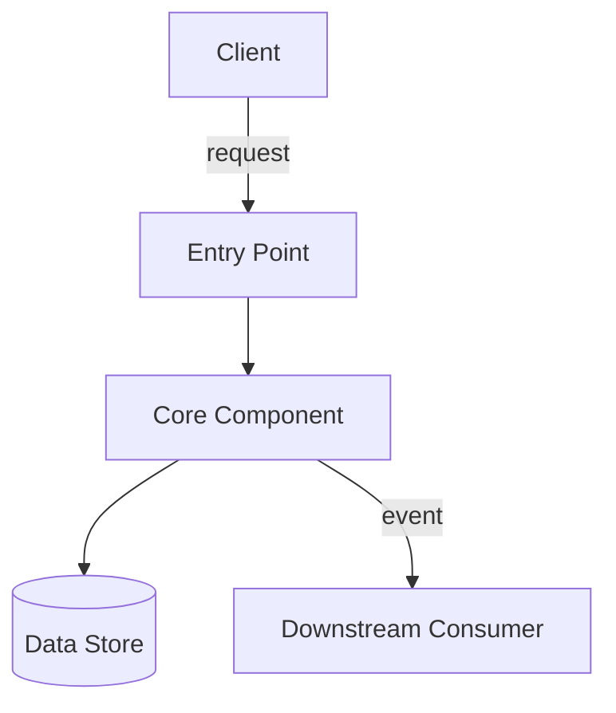
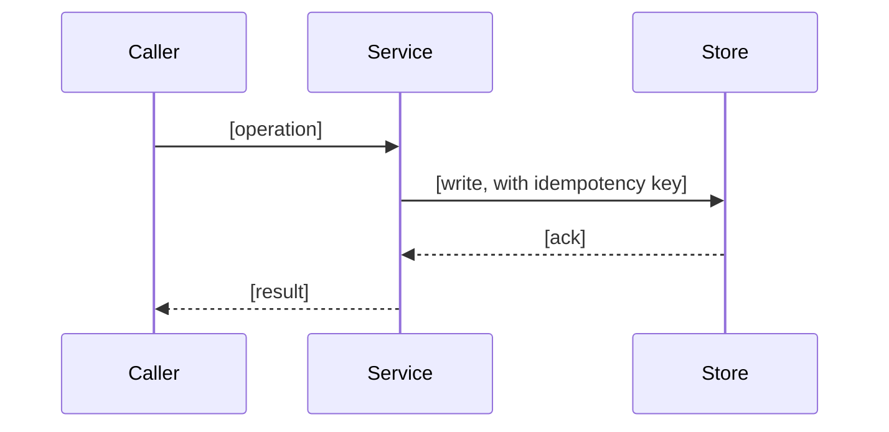
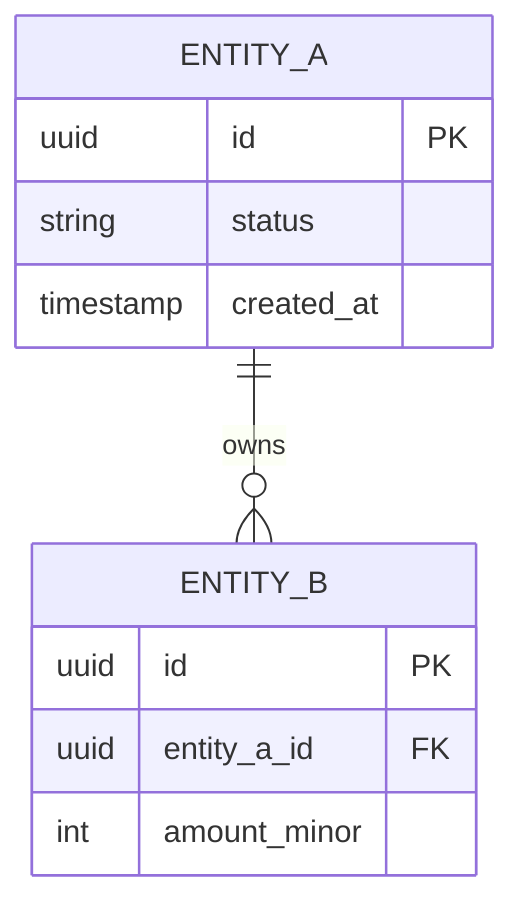
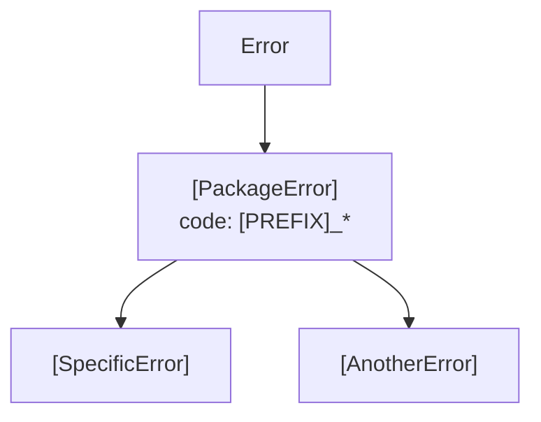

# Design Document

<!--
  TEMPLATE — the Vellum method's spec engine, document 2 of 3.
  Produced by the `spec-design` skill from `requirements.md`.
  Consumed by the `spec-tasks` skill.

  Rules that govern this document:
    - Every requirement in requirements.md MUST be addressed somewhere here.
      Nothing is dropped silently; a deliberate deferral goes in Open Questions.
    - Diagrams are Mermaid, in fenced ```mermaid blocks. No ASCII art, no images.
    - Where no implementation language is specified for an algorithm, give it in
      PSEUDOCODE — indented, language-neutral, no framework calls. Do not invent
      a language; do not paste real code from a repository you have not read.
    - Correctness Properties are the point of this document. They are derived
      from the EARS acceptance criteria and each one ends with a back-reference
      line of the form `**Validates: Requirements 1.2, 1.3**` — the criterion
      numbers sit inside the bold span, so the bare string `**Validates:**`
      appears in no finished document. See that section.
    - Replace every [bracketed placeholder]. Delete every HTML comment.
-->

## Overview

[Two to five paragraphs. State the approach chosen, in plain terms, and the single
most important trade-off it makes. A reader who knows the requirements should be
able to stop after this section and correctly describe the shape of the solution.]

**Approach:** [one sentence]

**Key trade-off:** [what is gained, and what is given up to gain it]

**Research summary:** [Findings from the research performed while writing this
document — library capabilities, prior art, options considered and rejected, protocol
or provider constraints. Summarise inline, with versions and file paths where relevant.
Do NOT create a separate research document; the findings live here or they do not exist.

This is **solution** research: what this should be built out of. What the system already
does was established in `requirements.md`'s `## Discovery` section — reference it, do not
restate it, and note here anything it got wrong or did not reach.]

## Applicable Standards

<!--
  REFERENCE the governing ADRs and rules. Do NOT restate their content — a spec is
  frozen work product, a standard is living, and a copied rule goes stale silently.
  List only what actually governs this change. Name the enforcing check where one
  exists: an agent asked to remember a rule will drop one, a linter will not.
-->

| Standard                    | Governs                          | Enforced by                           |
| --------------------------- | -------------------------------- | ------------------------------------- |
| [ADR or rule file, by path] | [what it governs in this change] | [the command that fails, or "review"] |
| [ADR or rule file, by path] | [what it governs in this change] | [the command that fails, or "review"] |

<!--
  Fill this from THIS repository's own canon — its ADR directory, its rules
  files, its lint config. Do not carry a row over from another repository
  because the shape looked familiar; a standard this repository does not have
  is worse than no row, because the design then cites a rule nobody enforces.

  Worked example of the shape, from a pnpm + Turborepo monorepo:

  | `docs/adr/NNNN-package-internal-structure.md` | layer direction inside a package | `.oxlintrc.json` no-restricted-imports |
  | `.agents/rules/versions.md` | catalog references, never literal versions | `pnpm validate` |
-->

**Unenforced standards are a finding, not a footnote.** Where this table says "review"
for something mechanically checkable, say so in Open Questions and name the check that
should exist.

## Glossary

<!--
  Inherits every term from requirements.md — do not contradict it. Add only the
  terms this document introduces: component names, internal states, invariants.
-->

| Term             | Definition                                        |
| ---------------- | ------------------------------------------------- |
| [Component Name] | [What it is and what it owns.]                    |
| [State Name]     | [A named state in a lifecycle referenced below.]  |
| [Invariant Name] | [A condition the design keeps true at all times.] |

## Architecture

[One or two paragraphs naming the pieces and the direction of dependency between
them. State explicitly which existing module, service, or package each new piece
lives in, and why that placement is correct.]



<!-- Use a sequenceDiagram for anything with ordering or failure timing: -->



### Dependency direction

[State the one-way rules. Which module may import which, and the rule that must
never be violated. If the repository already enforces boundaries, name the
mechanism that enforces this one.]

## Components

### [Component Name]

**Responsibility:** [one sentence, single responsibility]

**Location:** [path in the repository where this lives]

**Folder structure:**

<!--
  Every file this component adds. `spec-tasks` turns this into tasks; a design that
  says "a service and some types" yields a task plan that says the same thing.
  Annotate any path that is not self-explanatory — subpath entries, generated files.
-->

```
[path/to/module]/
├── src/
│   ├── [subject]/
│   │   ├── [symbol].[kind].ts
│   │   └── index.ts
│   └── index.ts              ← public barrel
└── test/
```

**Interface:**

[Real declarations in the repository's own language, with doc comments — name,
parameters, return type, thrown errors. A reader should be able to start
implementing without first inventing the public API. Only where no language is
fixed, describe the interface language-neutrally.]

```typescript
/** [What it does, and the invariant it maintains.] */
export interface [Name] {
  /** @throws {[ErrorName]} When [condition]. */
  [operation](input: [Shape]): [Result];
}
```

**Behaviour:**

[Prose for the ordinary path. Then the interesting algorithm in pseudocode:]

```
function [operationName](input):
    validate input against [rule]
    if [precondition fails]:
        return [error]
    acquire [resource] for input.[key]
    result = [transform]
    persist result with idempotency key input.[key]
    emit [event]
    return result
```

**Failure modes:** [what this component does when each dependency is unavailable]

### [Second Component Name]

[Same shape.]

## Data Model

[The entities, their fields, their keys, and their relationships. State the source
of truth for each field and whether a value is ever mutated after creation.]



| Field   | Type   | Nullable | Meaning                                   | Mutable after write           |
| ------- | ------ | -------- | ----------------------------------------- | ----------------------------- |
| [field] | [type] | [yes/no] | [business meaning, not the type restated] | [yes/no — and if no, say why] |

### Migrations

[What changes in the schema, in what order, and whether each step is safe to apply
while the previous version of the code is still running.]

## Correctness Properties

<!--
  THE MOST IMPORTANT SECTION IN THIS DOCUMENT.

  Derivation procedure (the `spec-design` skill performs this explicitly):

    For each acceptance criterion in requirements.md, decide:
      - EXAMPLE      — it fixes one concrete case ("WHEN the file is 5MB…").
                       It becomes a test case, not a property. Record it under
                       Testing Strategy instead.
      - UNIVERSAL    — it asserts something that must hold across a whole class
                       of inputs, states, or orderings. It becomes a Property.

    A universal criterion is rewritten with explicit quantification: begin the
    body with "For all…", "For any…", or "For every…", name the domain being
    quantified over, and state the condition that must hold without exception.

    Several criteria may collapse into one property; one criterion may produce
    several. Every property lists every criterion it validates, by number.

  Format is exact. Do not reflow it.
-->

Property 1: [Short noun-phrase title of the invariant]

For all [domain of quantification — e.g. "sequences of deposit and withdrawal
operations applied to a single account"], [the condition that must hold without
exception — e.g. "the derived balance equals the sum of all ledger entry amounts
for that account"].

**Validates: Requirements 1.2, 1.3**

Property 2: [Short noun-phrase title]

For any [domain — e.g. "two requests carrying the same idempotency key"], [the
condition — e.g. "THE Service produces exactly one persisted effect and returns
the identical response body to both requests, in any arrival order"].

**Validates: Requirements 2.1, 2.4, 3.1**

Property 3: [Short noun-phrase title]

For every [domain], [condition].

**Validates: Requirements 3.2**

<!--
  Coverage check — keep this table. Every requirement number from
  requirements.md appears in exactly one row, and every criterion is either
  bound to a property or explicitly marked as an example-level test case.
-->

### Requirement coverage

| Requirement | Criterion | Classification | Covered by                    |
| ----------- | --------- | -------------- | ----------------------------- |
| 1           | 1.1       | Example        | Testing Strategy, case [name] |
| 1           | 1.2       | Universal      | Property 1                    |
| 1           | 1.3       | Universal      | Property 1                    |
| 2           | 2.1       | Universal      | Property 2                    |
| 2           | 2.2       | Example        | Testing Strategy, case [name] |

## Error Handling

[The taxonomy of failures and the single rule for each. Be specific about what the
caller sees, what is logged, what is retried, and what is never retried.]

### Error hierarchy

<!--
  Required where the design introduces more than two error kinds. A caller branches
  on a stable code, never on a message.
-->



```typescript
export abstract class [PackageError] extends Error {
  abstract readonly code: `[PREFIX]_${string}`;
}
```

| Failure                        | Detection                        | Response                        | Caller sees            | Retryable |
| ------------------------------ | -------------------------------- | ------------------------------- | ---------------------- | --------- |
| [Invalid input]                | [validation at the boundary]     | [reject before any side effect] | [error shape / status] | No        |
| [Dependency timeout]           | [deadline exceeded]              | [backoff, bounded attempts]     | [error shape / status] | Yes       |
| [Conflicting concurrent write] | [version / constraint violation] | [return the stored result]      | [error shape / status] | No        |

**Partial-failure ordering:** [State the order of side effects such that any
prefix of them leaves the system in a reconcilable state. If there is no
distributed transaction, say so here and say what reconciles.]

## Testing Strategy

[How each property is exercised, and how the example-level criteria are covered.
Name the level of each test — unit, integration, property-based, isolation — and
what it asserts. Do not list a task plan here; that is tasks.md.]

### Property-based tests

| Property   | Generator / domain                            | Assertion                             |
| ---------- | --------------------------------------------- | ------------------------------------- |
| Property 1 | [random sequences of N operations]            | [derived value matches recomputation] |
| Property 2 | [duplicated requests, shuffled arrival order] | [single effect, identical response]   |

### Example-level test cases

| Case   | Derived from    | Setup     | Expected             |
| ------ | --------------- | --------- | -------------------- |
| [name] | Requirement 1.1 | [fixture] | [observable outcome] |

### Out of scope for automated testing

[Anything that genuinely cannot be automated, with the reason. Keep this list
short; a long list is a design smell.]

## Open Questions

<!--
  Real unknowns only. Each one names who or what resolves it and what the design
  assumes in the meantime. An empty section is deleted; a section full of
  questions the author could have answered by reading the code is a defect.
-->

| #   | Question   | Blocking? | Assumed for now                          | Resolved by                       |
| --- | ---------- | --------- | ---------------------------------------- | --------------------------------- |
| 1   | [question] | [yes/no]  | [the assumption this design proceeds on] | [person, document, or experiment] |
